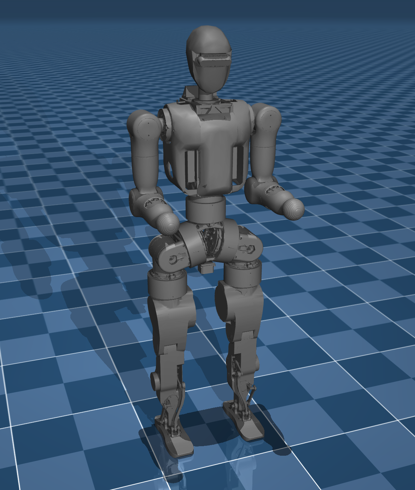

[简体中文](README.md) | English

# Wiki-GRx-MJCF



This repository provides a tool to transfer from URDF file to MJCF. It is developed for converting the Fourier GRx robot URDF files to MJCF files.
However, it can also be used for other URDF files.

## User Guide

1. Install the package using pip

   ```shell
   pip install -e .
   ```

2. Test the package installation

   ```shell
   urdf2mjcf --help
   ```

   ```
   usage: urdf2mjcf [-h] [-s SENSOR_CONFIG] [-m MUJOCO_NODE] [--ground] [--lighting] [--version] [-l] [urdf] [mjcf]
   
   Copyright (c) 2022 Fraunhofer IPA; use option '-l' to print license.
   
   Parse a URDF model into MJCF format
   
   positional arguments:
     urdf              the URDF file to convert (default: <_io.TextIOWrapper name='<stdin>' mode='r' encoding='utf-8'>)
     mjcf              the converted MJCF file (default: <_io.TextIOWrapper name='<stdout>' mode='w' encoding='utf-8'>)
   
   optional arguments:
     -h, --help        show this help message and exit
     -s SENSOR_CONFIG  the XML file of the sensor configuration (default: None)
     -m MUJOCO_NODE    the XML file defining the global MuJoCo configuration (default: None)
     --ground          whether to add the default ground plane to the MuJoCo model (default: False)
     --lighting        whether to add the default lighting to the MuJoCo model (default: False)
     --version         show program's version number and exit
     -l                print license information (default: False)
   ```

3. Convert a URDF file to MJCF

   ```shell
   urdf2mjcf /path/to/models /path/to/mjcf
   ```

   ```shell
   # Convert N1 example
   urdf2mjcf ./models/N1/urdf/N1_raw.urdf ./models/N1/mjcf/N1_raw.xml
   ```

4. Change base height of the robot:

   ```
   # 编辑 MJCF 文件中的 <body name="base">
   <body name="base" pos="0 0 0.70">
   ```

5. Refine the MJCF file:
    - The MJCF file generated by the tool is a basic version. You can manually refine the MJCF file according to your requirements.
    - The refined MJCF file should be placed in the `./models/N1/scene/` directory.

## Verification

1. Start Mujoco Viewer

   ```
   python -m mujoco.viewer
   ```

2. Drag the generated MJCF file into the Mujoco Viewer window to check if the model is correct.

## Thanks

- https://github.com/balandbal/urdf2mjcf

---

Thank you for your interest in the Fourier Intelligence N1 robot project!  
We hope this resource will provide strong support for your robotics development!
